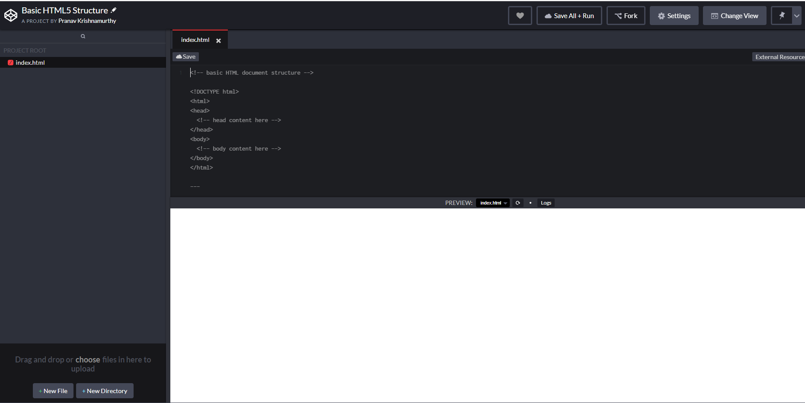
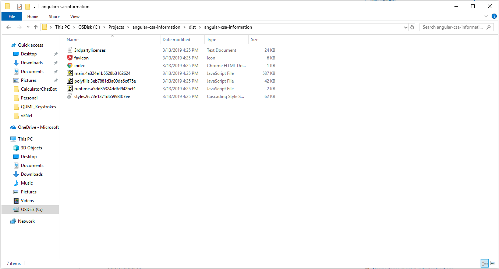
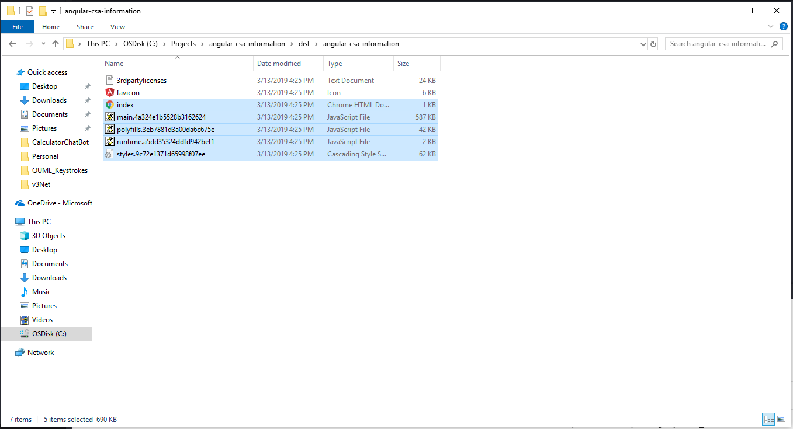
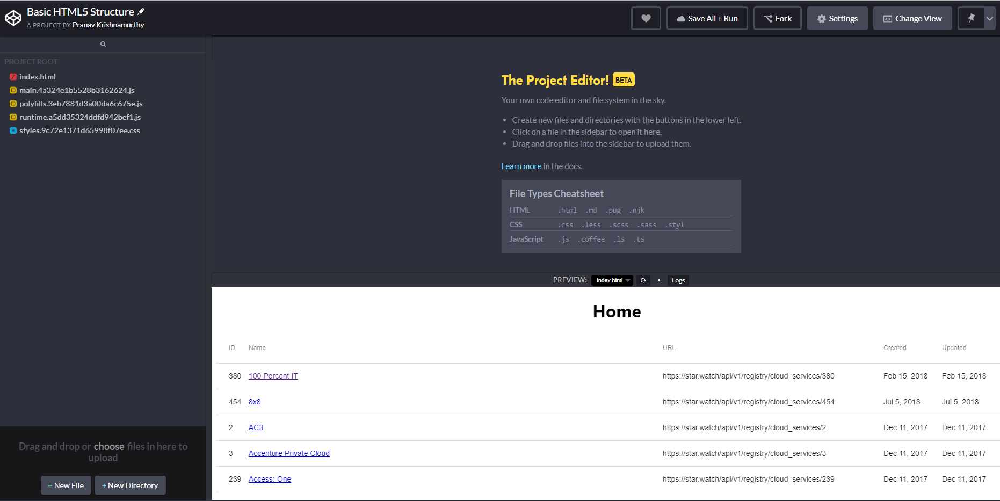

# Angular CSA Information

This project was generated with [Angular CLI](https://github.com/angular/angular-cli) version 7.1.1.

## Development server

Run `ng serve` for a dev server. Navigate to `http://localhost:4200/`. The app will automatically reload if you change any of the source files.

## Code scaffolding

Run `ng generate component component-name` to generate a new component. You can also use `ng generate directive|pipe|service|class|guard|interface|enum|module`.

## Build

Run `ng build` to build the project. The build artifacts will be stored in the `dist/` directory. Use the `--prod` flag for a production build.

## Running unit tests

Run `ng test` to execute the unit tests via [Karma](https://karma-runner.github.io).

## Running end-to-end tests

Run `ng e2e` to execute the end-to-end tests via [Protractor](http://www.protractortest.org/).

## Further help

To get more help on the Angular CLI use `ng help` or go check out the [Angular CLI README](https://github.com/angular/angular-cli/blob/master/README.md).

## CodePen Instructions
In order for you to get this code working in CodePen, please follow the below steps: 

1. Run `ng build --prod` this will enable a production build and all the build artifacts are stored in the `dist/angular-csa-information` directory.
2. Navigate to CodePen.io - if you have an account already create a new project with the Basic HTML5 Structure. 
3. Once the new project is created you want to just ensure that the `index.html` file is the only file that exists. Refer to the screenshot below:
    

4. Previously in step 1, the result entails files that would reside in the folder `dist/angular-csa-information` directory. The directory should like something like the screenshot below: 
   

5. From the screenshot in the previous step, select the following files: `index.html`, the CSS file, and the 3 JavaScript files. The file names for the CSS file and the JavaScripts are generated automatically by the CLI. Once you have selected the files, your screen should be similar to this: 
   

6. Drag the selected files in Step 5 above, into the CodePen.io editor. You will get a warning if you want to overwrite the `index.html` file because it already existed. If that happens, select the option that would allow you to overwrite the `index.html` file. Your screen should now look like this: 
   

   A note that should be made - Anytime that changes are made to the app, and the command `ng build --prod` is executed, the names of the JavaScript and CSS files may change. 

7. (If you have a PRO level account) Towards the bottom of the CodePen.io editor you have a button that reads *Deploy* - this would allow you to have a fully functional website that is hosted by CodePen servers.
